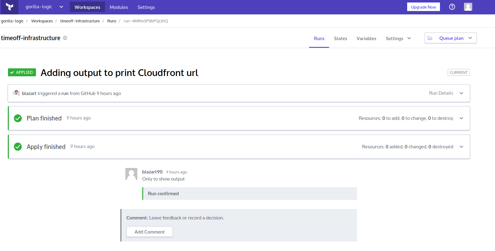
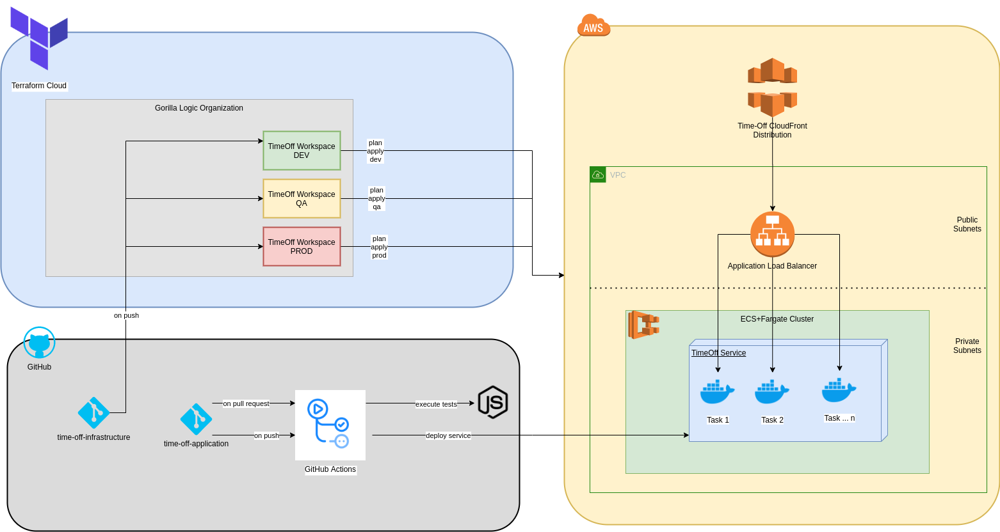

#Time-Off Project Infrastructure Configuration

This project has been created to deploy a simple infrastructure for Time-off Project (https://github.com/blazart/timeoff-management-application). The main idea is to deploy a simple high availability cluster

##Components

* Networking Module : Complete documentation can be found [here](networking/readme.md)
* Application Module : Complete documentation can be found [here](application/readme.md)

##IaC Deployment
This project can be executed locally or using terraform cloud. In this case we are using terraform cloud (https://app.terraform.io/) to deploy the whole infrastructure to AWS Cloud 

To deploy infrastructure you only need to make changes in master branch. You can do it creating a pull request to master branch and once it is accepted terraform starts to execute.

NOTE: In addition to approve pull request. Terraform plan has to be approved in terraform cloud before apply it.

